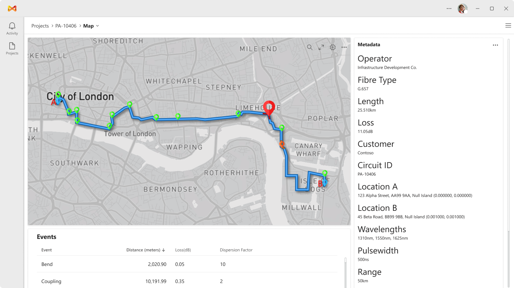
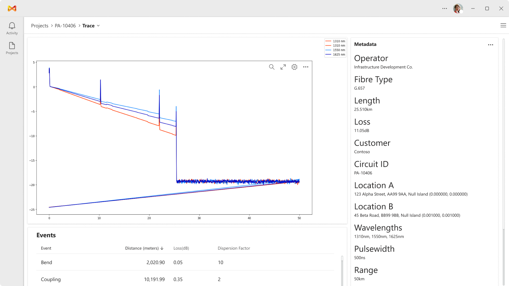

# OpenOTDR

OpenOTDR makes building OTDR Reports, Localising Faults, and Sharing Results easy.

A next-generation OTDR Fibre Test report solution. Enabling users to integrate OTDR traces with GIS data, view & label traces, and build reports.

Coming Soon to iOS, Android, Mac, Windows, and Linux!

Map View           |  Trace View
:-------------------------:|:-------------------------:
 | 

### Simplicity, Speed, and Accessibility

We want to make OpenOTDR as simple as possible, with powerful, easy-to-use features that make sense to Fiber Technicians and Engineers.

We will also be implementing features that have been on the roadmap for years, fixing issues in classification, and making it possible to integrate with the BaldrAI cloud platform in the future (more on this later).

### Core features

- Load SOR trace data
- Load GIS map path data
- Load Fibre scope pictures
- Map SOR trace to GIS path
- Label features in trace data
- Create report PDFs
- Create and Manage tests in Projects
